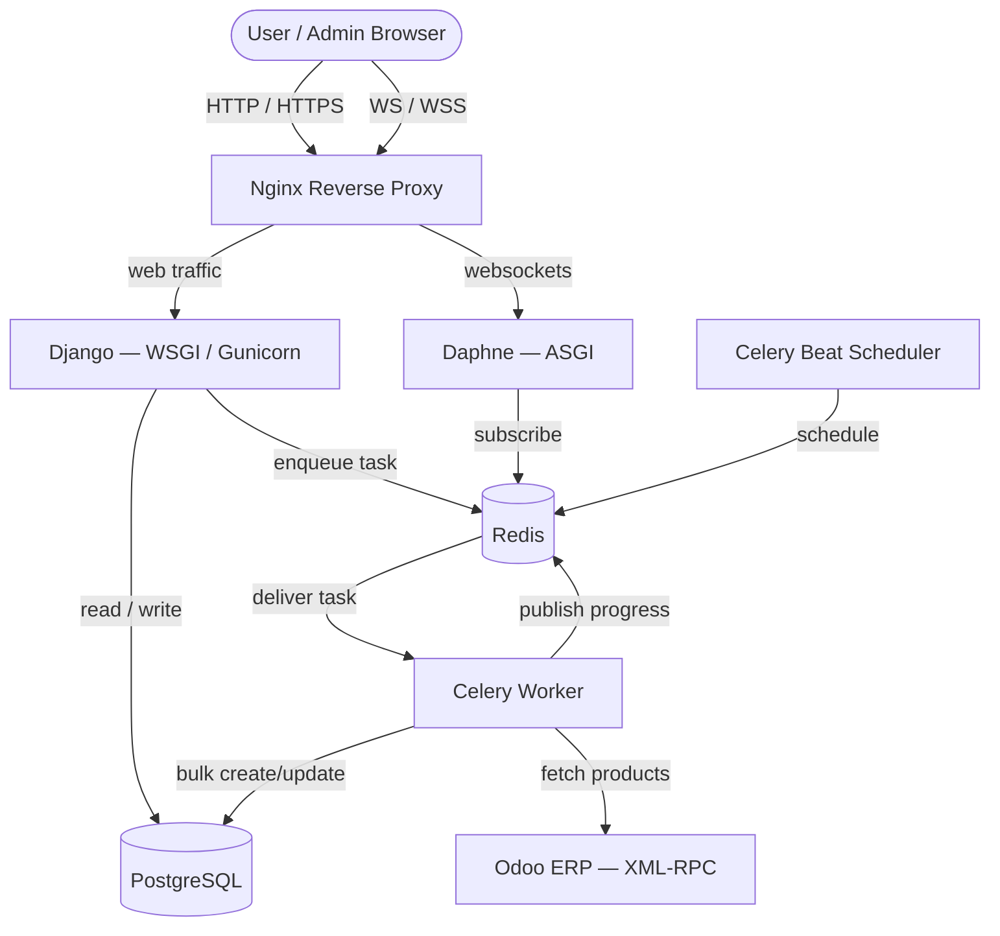

# Remake_X — Sustainable E-Commerce & ERP Sync Platform


**Live demo:** [remakex-production.up.railway.app](https://remakex-production.up.railway.app/)
**Source:** [github.com/official-noman/Remake_X](https://github.com/official-noman/Remake_X)

---

## Overview

**Remake_X** is a full-stack sustainable e-commerce platform built on Django 5.1, where users buy, sell, and upcycle products instead of discarding them. The platform's core technical achievement is a production-grade **bidirectional synchronization engine with Odoo ERP** — keeping local product catalogs, pricing, and stock levels continuously aligned with a real ERP system of record via XML-RPC.

The architecture is built around an async-first design: **PostgreSQL** for relational data, **Redis** as the Celery broker and Channels layer, **Celery** for background orchestration, **Django Channels** for live WebSocket updates, and **Docker** for reproducible, multi-service deployment.

---

## Key Features

- 🛍️ **Complete e-commerce flows** — cart, Stripe checkout, product explore/search, seller listings, designer hiring
- 🔄 **Odoo ERP synchronization** — full catalog sync and incremental delta sync via XML-RPC
- ⚡ **Real-time sync dashboard** — live progress pushed over WebSocket using Django Channels, no polling
- ⏳ **Resilient background processing** — Celery Beat scheduling, exponential-backoff retries, chunked bulk DB writes
- 🔒 **Configurable conflict resolution** — `ODOO_WINS` / `LOCAL_WINS` / `MANUAL` strategies, adjustable without a restart
- 🧪 **Tested** — pytest suite covering connector, tasks, API, WebSocket consumers, and models
- 🐳 **Production-style containerization** — Nginx reverse proxy, Daphne (ASGI), Gunicorn (WSGI), Celery worker + beat, all orchestrated via Docker Compose

---

## System Architecture

HTTP traffic is served over WSGI/Gunicorn; WebSocket connections for live sync progress are routed separately to ASGI/Daphne. Celery Beat schedules recurring sync jobs, which workers execute against Odoo before writing back to PostgreSQL and broadcasting progress through Redis.



---

## Tech Stack

| Layer | Technology | Role |
|---|---|---|
| Backend | Django 5.1.3 | Core web framework |
| API | Django REST Framework | Internal API + filtering |
| Database | PostgreSQL 15 | Primary data store |
| Broker / Channel layer | Redis 7 | Celery broker + Channels backend |
| Async tasks | Celery 5.4 | Background workers + scheduled beat |
| Real-time | Django Channels + Daphne | WebSocket sync progress |
| Web server | Nginx + WhiteNoise | Reverse proxy + static files |
| Payments | Stripe API | Checkout |
| ERP integration | Odoo XML-RPC | Product/inventory source of truth |

---

## Database Design

| Model | Purpose |
|---|---|
| `OdooProduct` | Mirrors Odoo product data (`odoo_id`, `odoo_price`, `odoo_qty_available`, `sync_status`); `OneToOneField` to `myapp.Product` |
| `SyncLog` | Audit trail per sync run (FULL/DELTA/MANUAL) — records fetched/created/updated/skipped/errored counts, duration, and error detail |
| `SyncConfig` | Singleton config — batch size, schedule interval, conflict resolution strategy — editable at runtime |
| `myapp.Product` | Core e-commerce catalog item |
| `myapp.CustomUser` | Custom auth model (buyer/seller roles) |

---

## Odoo Sync — Request Flow

```
User → Django → Celery → Redis → Odoo → PostgreSQL → UI
```

1. **Trigger** — Admin clicks "Trigger Full Sync" on the dashboard.
2. **Django** — `trigger_manual_sync` creates a `SyncLog` (`status=RUNNING`), enqueues the task via Redis, and immediately returns the `sync_log_id` to the browser (non-blocking).
3. **Celery** — A worker picks up the task, authenticates against Odoo via XML-RPC, and fetches products in batches (`batch_size` from `SyncConfig`).
4. **Progress broadcast** — After each batch, `notify_sync_progress()` publishes to a Redis channel group.
5. **WebSocket delivery** — Daphne's `SyncStatusConsumer` consumes the Redis message and pushes it to any open admin WebSocket connection.
6. **PostgreSQL write** — The worker performs `bulk_create` / `bulk_update` on `OdooProduct`, applying the configured conflict resolution strategy.
7. **UI update** — The dashboard re-renders progress live and shows a final SUCCESS/FAILED state once `notify_sync_completed()` fires — no page refresh required.

---

## Local Development

### Prerequisites
- Docker & Docker Compose
- Python 3.11+ (only needed if running outside Docker)

### 1. Configure environment

```bash
cp .env.example .env
```

```ini
DEBUG=True
SECRET_KEY=your_secret_key
DATABASE_URL=postgres://postgres:postgres@db:5432/postgres
REDIS_URL=redis://redis:6379/0
ODOO_URL=https://your-odoo-instance.com
ODOO_DB=your_db
ODOO_USERNAME=your_username
ODOO_PASSWORD=your_password
```

### 2. Build and run

```bash
docker compose up --build -d
```

### 3. Migrate and create an admin user

```bash
docker compose exec web python manage.py migrate
docker compose exec web python manage.py createsuperuser
```

App is available at `http://localhost:8080` (via Nginx) or `http://localhost:8000` (direct to Django).

---

## Environment Variables

| Variable | Description |
|---|---|
| `SECRET_KEY` | Django secret key |
| `DEBUG` | `True`/`False` |
| `DATABASE_URL` | PostgreSQL connection string |
| `REDIS_URL` | Redis connection string (Celery broker + Channels) |
| `ODOO_URL` | Odoo instance base URL |
| `ODOO_DB` | Odoo database name |
| `ODOO_USERNAME` | Odoo login |
| `ODOO_PASSWORD` | Odoo password |

---

## Deployment (Railway)

Live at [remakex-production.up.railway.app](https://remakex-production.up.railway.app/).

1. Provision **PostgreSQL** and **Redis** as Railway plugins.
2. Set all variables from `.env.example` in the Railway dashboard.
3. Railway builds from the included `Dockerfile`.
4. `ALLOWED_HOSTS` and `CSRF_TRUSTED_ORIGINS` in `settings.py` already whitelist the Railway domain.

---

## Testing

```bash
docker compose exec web pytest odoo_sync/tests/ -v
```

Coverage report:

```bash
docker compose exec web pytest --cov=odoo_sync odoo_sync/tests/ --cov-report=term-missing
```

**Current coverage: 92%** across 69 tests — connector, tasks, models, API, admin, WebSocket consumers, and health checks.

---

## Project Structure

```text
Remake_X/
├── docker-compose.yml
├── Dockerfile
├── manage.py
├── requirements.txt
├── upcycle/                 # Django project config
│   ├── settings.py
│   ├── urls.py
│   ├── asgi.py               # Daphne entrypoint
│   └── celery.py
├── odoo_sync/                # Odoo integration module
│   ├── models.py             # OdooProduct, SyncLog, SyncConfig
│   ├── tasks.py               # Celery sync logic
│   ├── connector.py          # XML-RPC client
│   ├── ws_utils.py            # WebSocket broadcast helpers
│   ├── consumers.py           # Channels consumer
│   ├── views.py                # DRF endpoints
│   └── tests/
├── myapp/                     # E-commerce app
│   ├── models.py               # Product, CustomUser
│   ├── views.py
│   └── forms.py
├── templates/
└── nginx/
    └── nginx.conf
```

---

## Challenges Solved

- **Avoiding DB locks on large syncs** — chunked fetches (`batch_size=100`) combined with `bulk_create`/`bulk_update` inside transactions instead of per-row saves.
- **Non-blocking UX during long syncs** — the trigger endpoint returns instantly with a task ID; actual progress streams over WebSocket via Redis pub/sub, so the UI never blocks on an HTTP timeout.
- **Resilient to Odoo downtime** — XML-RPC calls wrapped in retry logic with exponential backoff (max 3 retries); failures are caught per-record so one bad record doesn't abort the whole sync, and full tracebacks are stored in `SyncLog.error_detail`.

---

## Future Improvements

- **Bi-directional sync** — push local inventory changes (e.g. a Stripe purchase) back to Odoo via webhook.
- **Warehouse management module** — shelf/rack/bin location tracking with low-stock alerts.
- **Kubernetes deployment** — migrate from single-VM Docker Compose to a K3s cluster with HPA.
- **Decoupled frontend** — React/Next.js consuming the existing DRF endpoints.

---

## License

MIT — see [LICENSE](LICENSE).